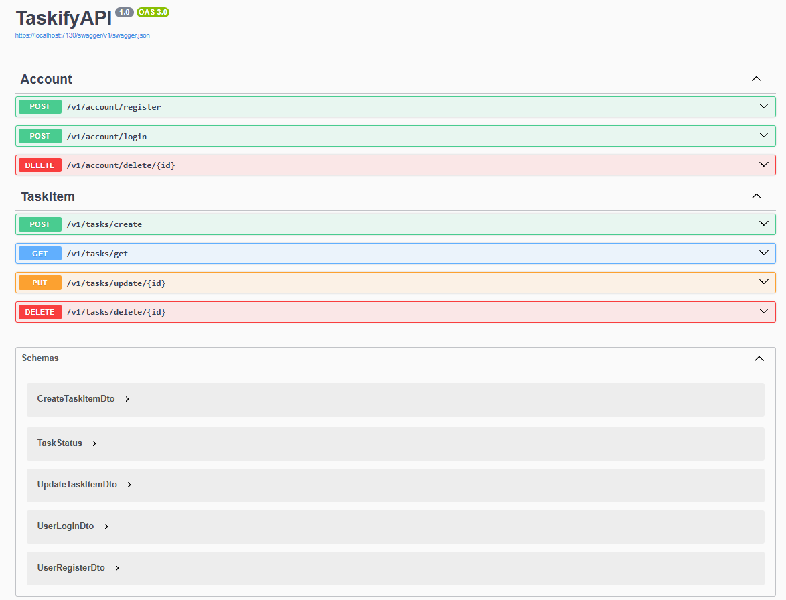

# ✅ Taskify API - ASP.NET Core

---

## 🖼️ Stack Visual

  
  &nbsp;&nbsp;
  
  &nbsp;&nbsp;
  
  &nbsp;&nbsp;
  

---

## 📝 Descrição

**Taskify API** é uma **API RESTful** construída em **ASP.NET Core** com foco em **boas práticas REST, Repository Pattern e Clean Architecture**, permitindo o gerenciamento de tarefas vinculadas a usuários autenticados via **JWT**.  
Desenvolvida para **estudo pessoal e portfólio para recrutadores**.

---

## 🚀 Funcionalidades

- ✅ Autenticação **JWT Bearer**
- ✅ **Claims personalizadas** no token
- ✅ Cadastro de usuários
- ✅ Login e exclusão de usuários
- ✅ CRUD completo de **tarefas vinculadas ao usuário autenticado**
- ✅ Obter tarefas por **ID** ou por **usuário**
- ✅ Validações robustas via **FluentValidation**
- ✅ Documentação interativa via **Swagger**

---

## 🛠️ Tecnologias utilizadas

- **ASP.NET Core**
- **Entity Framework Core**
- **SQL Server**
- **FluentValidation**
- **JWT Bearer Authentication**
- **Swagger**
- **JetBrains Rider**

---

## 🖼️ Preview do Swagger

---
